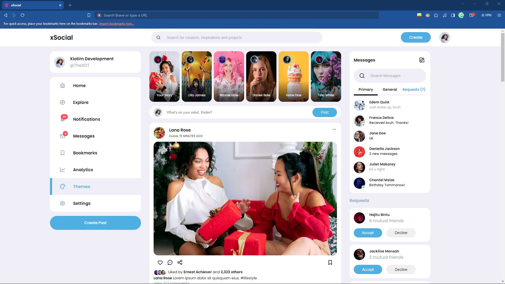
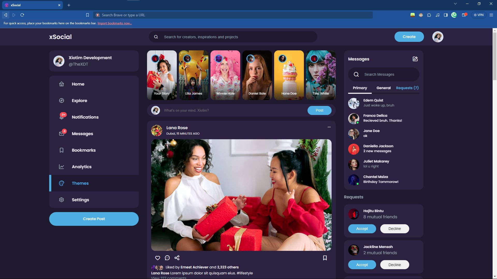
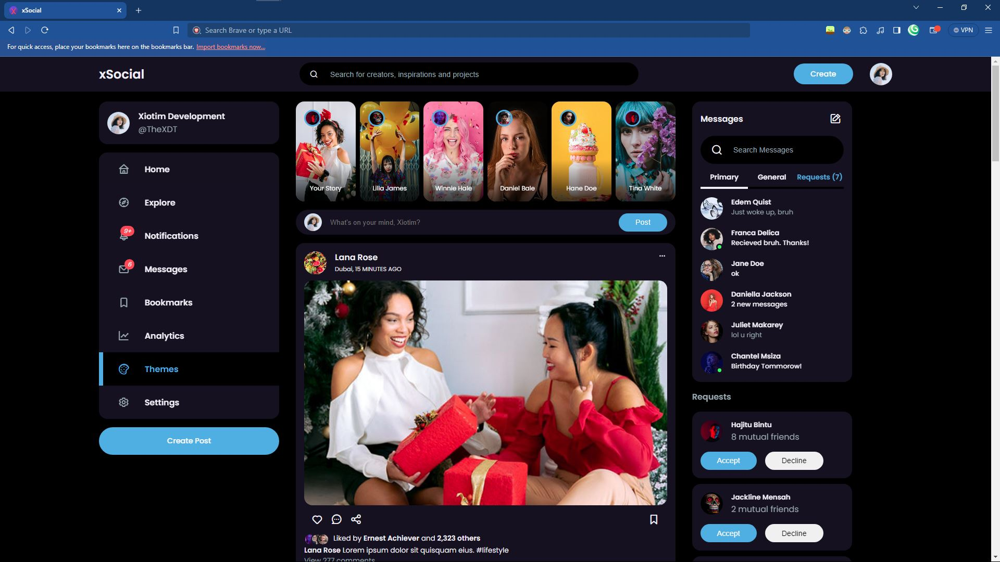

# xSocial

This is a GitHub Repository for xSocial - a clone of Instagram & Facebook (though mostly  Facebook, the platform; not the company). This is basically for both of us; me because I have a back-up just in-case my hard-drive fails.

And for you? Well, you don't have to waste 2½ hours on a tutorial: and if you get stuck you have resource code (well with a few modifications.) And if you are just a barely beginner, modify this code: as you please.

The Pictures are avaible at this [link](https://drive.google.com/file/d/1538eTIZ3uvVXFn3y6jJoisvI-SgljbFt/view?usp=sharing)

**(Thanks EGATOR!)**

## Acknowledgements

 - Orignial written and shown on  [EGATOR](https://www.youtube.com/@EGATORTUTORIALS)'s channel.
 - A Huge shoutout, to my latest project at the time of writing this: [XDT-Xirox](https://github.com/l-xdt/xirox)
 - Still one of the OG's in this project: [DiffChecker](https://www.diffchecker.com)
    (if the code is available.)


## Authors

- [LidenSchaft Xiotim-Development Team (Limited)](https://www.github.com/l-xdt)
- [Alvin Maranx, II ツ (Avun)](https://www.github.com/avun-ai)
- [EGATOR](https://www.github.com/l-xdt)


## Demo

There is a Demo on this project! And I'm not being in-direct, so here it is, click [here](https://l-xdt.github.io/xSocial)

## Features

- Color Switcher, between 5 colors

- Light, Dim and Lights Out Toggle

- Messages  Search

- Notification Panel

- **PS:** This is like Instagram, so don't use the 10K instead of 10,000 hack here.


## Screenshots





**Written in Plain HTML, CSS and JavaScript, and there is too much to explore, so do some exploring on your own.**


## Run Locally

Clone the project and run it on XAMPP

(**PS:** I would recommend an alternative domain from localhost, for it to feel more real.)

```bash
  git clone https://github.com/l-xdt/xSocial
```

Go to the project directory

```bash
  cd xSocial
```

Install XAMPP (via Chocalatey, if you don't have it.)

```bash
  chocalatey install xampp
```

Start the server

```bash
  [Directory]/[ServerName]/apache-start.bat
```

**PS:** If you trust your web skills, here is the manual on the self-hosted domain: [here](https://www.youtube.com/watch?v=_eQGAJVtRCs) (by Soeng Song)

## Roadmap

- Additional browser support

- Change what you want to see on your feed.

- Create how many posts you wan to see; because this is your version of FaceBook x Instagram.

- Have a profile name and photo to your liking

- Make it yours: change the background, do whatever you want.

- Supported on Phone with minor bug: Modal doesn't work fully on mobile due to badly written code.

- This is all written by hand: using no outside frameworks, with only an Icon pack.

- Another Favicon influeced by the Lieden Corpration, with our signature: **X**


## Support

For support, email either of our emails: [this one](mailto:trowesigames@gmail.com) or [this one](mailto:leidenschaft.tech@hotmail.com), and if we don't respond Join our Discord Sever, which is not up as of writing this readMe.


## Feedback

This still applies to feedback, keep in mind the bug that I have stated, and will try to fix as soon as possible.

Whether your feedback is positive or negative, send away! As long as you are just giving constructive-critsism and not being very sinister; We will take a look at your email.

If your email is very sinister, we will not take a look at your email, and if found targeting and/or doxxing will be reported to Google.

You can send whatever you would like to either of these email addresses: [The OG One](mailto:trowesigames@gmail.com) or [The New One](mailto:leidenschaft.tech@hotmail.com)


## FAQ

Now, with that out of the way, FAQ time!

#### Can I change this in anyway I want?

Yes! Do As you please with this website, change everything even the icons with FontAwsome, nothing a Replace on everything can't change. This isn't linked to any frameworks, so editing the JavaScript will not kill anything.

#### Can I host this, if I can how?

Yes you can, use what you want. That is up to you. But I choose XAMPP: Read the following to understand why.

**My Thoughts on XAMPP.**

I have loved XAMPP for the longest time due to it's magical work on any Hardware, and if you use re-compiled versions of it like WAMP, they choose on what they want to work with.

As A developer who started on a Netbook, this meant the world to me, who at the time was using my 2GB of ram wisely, skipping between Ubuntu, elementaryOS 5 and Windows 7 Profesional. So cross-compatibilty was very important.

So if you want use it (because I'd love you to **<3**)

A little explanation of how XAMPP works, you see on Windows, Linux and macOS (if you bind it) 127.0.0.1 is a link to your computer. So XAMPP takes use of this and now hosts your projects for you even if they are in PHP.

**PS:** Even though you are not hosting it, please extract it from the .zip before use or you will end up with a Javascript and CSS-less website.

#### How Do I host this?

Now that we have talked about how it works, Here are tutorials:

For beginners, here is how you start off with XAMPP: [here](https://www.youtube.com/watch?v=LzucEZh4_no) by MainlyWebStuff ~ to start you off.

And if you are more of an intermideate, here is how to link it to the domain of your choice and dreams: [here](https://www.youtube.com/watch?v=_eQGAJVtRCs) by Soeng Song

## Used By

This project is used by the following companies:

- LeidenSchaft-Xiotim Accquisitions (Limited)

- XDT-Studium

- Xiotim Development Team [Limited] (XDT)

- XDT-noHesi


## Installation

If you would like to install XAMPP look at the tutorial in FAQ, that I have kindly linked again: [here](https://www.youtube.com/watch?v=LzucEZh4_no) by MainlyWebStuff - and If you want the text-form: check Run Locally

```bash
    chocalatey install xampp
```
    
## Related

Here are some related projects:

- [XioTok](https://github.com/l-xdt/xiotok)

- [noHesi](https://github.com/l-xdt/no-hesi)

- [Xirox](https://github.com/l-xdt/xirox)

- [Studium](https://github.com/l-xdt/studium)

- [XioTim](https://github.com/l-xdt/xiotim)

- [XioTube](https://github.com/l-xdt/xiotube)


## Documentation

- I cannot tell you about all the documentation, so please refer to

- EGATOR's [Tutorial](https://www.youtube.com/watch?v=AiFfDjmd0jU)


## API Reference

As earlier refreneced, there is no APIs or Frameworks in this project, otherwise, I will update this ReadMe.

